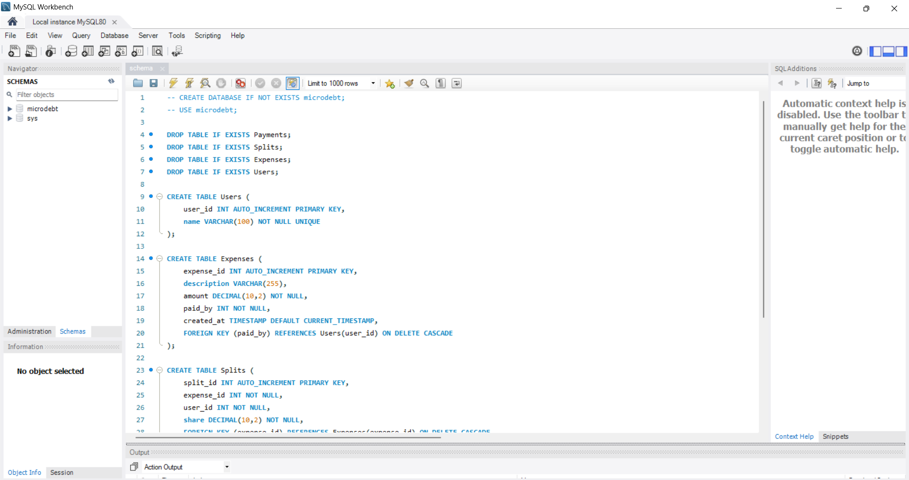
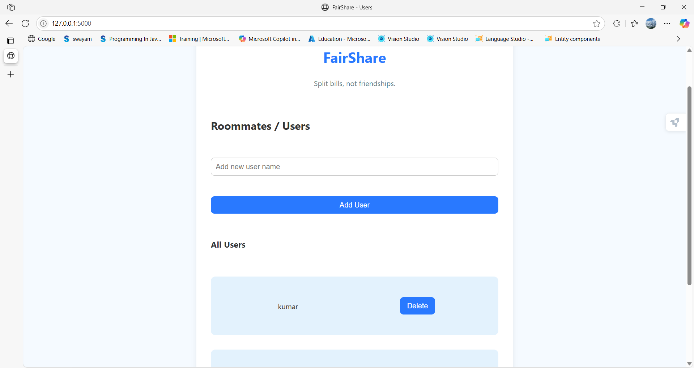
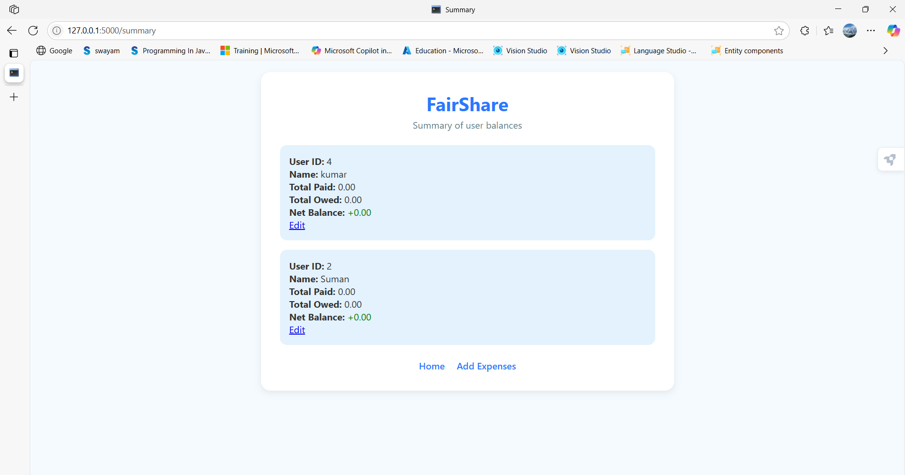

# 💸 Micro Debt Tracker

**Effortless debt tracking — simple, smart & database-powered!** 🎯

## 🚀 Project Overview

Welcome to **Micro Debt Tracker**, a sleek little web app built with **Flask**, **MySQL**, and clean **HTML/CSS**. Designed to help you manage shared debts easily, this project focuses on the **backend & database magic** — no clutter, just core functionality.

* 🖥️ Developed locally with Flask & MySQL for smooth development
* ☁️ Deployed on **PythonAnywhere** — access it anytime, anywhere!
* 🔓 No login or user hassles — jump straight into debt tracking

## 🌟 Highlights

* ✅ Pure backend & database showcase — built to impress with clean logic
* 💡 Minimal UI — all about the core debt tracking functionality
* 🌐 Live & accessible via a public URL on PythonAnywhere
* 📊 Focus on accurate debt & payment management
* 🔥 No distractions like login pages or complex flows — just the essentials

## 🌍 Live Demo

See it in action here:
🔗 https://aalokhya.pythonanywhere.com/

> ⚠️ *Note:* This platform is hosted on a free PythonAnywhere 30-day trial. It may sometimes experience downtime or minor errors due to free-tier limitations, but it effectively demonstrates the main functionality and database skills.

## Screenshots 📸

### 1. Database Schema

### 2. Home Page

### 3. Add Expense Page

### 4. Summary Page

> ⚠️ *Note:* This project highlights **database and backend skills**. The UI is intentionally minimal to keep the focus where it counts.

## 🛠️ Tech Stack

| 🔧 Technology     | 🎯 Purpose                     |
| ----------------- | ------------------------------ |
| 🐍 Flask          | Lightweight web framework      |
| 🗄️ MySQL         | Reliable database management   |
| 🎨 HTML & CSS     | Simple, clean front-end design |
| ☁️ PythonAnywhere | Cloud deployment & hosting     |

## 💡 Why This Project?

This Micro Debt Tracker is a perfect example of crafting a **functional backend app** with strong database integration — ideal for showcasing your **Flask routing, SQL handling, and cloud deployment skills**. No fuss, no fluff, just powerful core functionality.

## ✉️ Get In Touch

Have questions or ideas?
Let’s connect! 😊

Would you like me to help with setup or usage instructions too?
